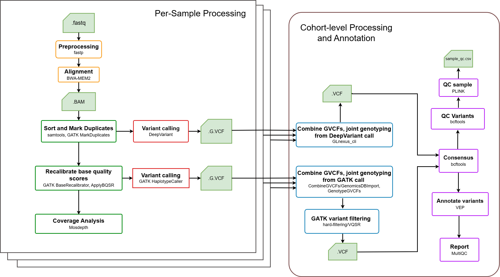

# GermVarX
**An Automated Workflow for Joint Germline Variant Exploration in Whole-Exome Sequencing Cohorts**

GermVarX is an open-source workflow for joint germline variant discovery and exploration in WES cohort studies. A key feature of GermVarX is its implementation of joint variant calling, enabling simultaneous genotyping of multiple samples to produce a single, high-confidence multi-sample VCF, optimized for downstream analyses. Implemented in Nextflow DSL2 with Docker, it supports fully automated execution, a modular architecture, and parallelized task execution across diverse computing environments, including workstations, HPC clusters, and cloud platforms. The workflow integrates two state-of-the-art variant callers—GATK HaplotypeCaller and DeepVariant—with joint genotyping performed via GATK or GLnexus. To increase reliability, GermVarX supports consensus generation between callers, coupled with sample- and cohort-level quality control, functional annotation using the Variant Effect Predictor (VEP), and unified reporting through MultiQC. In addition, it provides PLINK-compatible outputs, facilitating seamless integration with statistical and association analyses.

<p align="center">
    
</p>

---

## Environment Setup

### Install Docker
Follow the installation instructions for your platform:  
👉 [Docker Installation Guide](https://docs.docker.com/engine/install/)

### Install Nextflow
GermVarX requires **Nextflow (version ≥ 24)**.  
👉 [Nextflow Installation Guide](https://www.nextflow.io/docs/latest/getstarted.html)

---

## Download the GermVarX Pipeline and Test Datasets

Clone the source code from the official GitHub repository:

```bash
git clone https://github.com/thaontp711/GermVarX.git
cd GermVarX
```
Create a directory for the test data and download paired-end WES FASTQ files for two samples along with the corresponding target BED file:

```mkdir -p testdata/fastq testdata/bed
cd testdata/fastq

# Sample 1: NA12891
wget https://storage.googleapis.com/brain-genomics-public/research/sequencing/fastq/novaseq/wes_agilent/50x/NA12891.novaseq.wes_agilent.50x.R1.fastq.gz
wget https://storage.googleapis.com/brain-genomics-public/research/sequencing/fastq/novaseq/wes_agilent/50x/NA12891.novaseq.wes_agilent.50x.R2.fastq.gz

# Sample 2: NA12892
wget https://storage.googleapis.com/brain-genomics-public/research/sequencing/fastq/novaseq/wes_agilent/50x/NA12892.novaseq.wes_agilent.50x.R1.fastq.gz
wget https://storage.googleapis.com/brain-genomics-public/research/sequencing/fastq/novaseq/wes_agilent/50x/NA12892.novaseq.wes_agilent.50x.R2.fastq.gz

cd ../bed
wget https://storage.googleapis.com/brain-genomics-public/research/sequencing/grch38/bed/agilent.targets.grch38.bed
```

---

## Set Up Docker Images

Pull the required pre-built images and build the GermVarX custom image:

```bash
# PLINK 1.9
docker pull quay.io/biocontainers/plink:1.90b6.21--h516909a_0

# GATK 4.2.6.1
docker pull broadinstitute/gatk:4.2.6.1

# DeepVariant 1.6.1
docker pull google/deepvariant:1.6.1

# VEP 114.1
docker pull ensemblorg/ensembl-vep:release_114.1

# GLnexus 1.4.1
docker pull quay.io/biocontainers/glnexus:1.4.1--h17e8430_5

# GermVarX pipeline (custom image)
docker build -t germvarx-pipeline:0.1 ./docker/germvarx-pipeline
```

---

## Configure Parameters

Configure input parameters and execution settings in the configuration files provided within the `configuration` directory. For detailed instructions and parameter descriptions, please refer to [the protocol documentation](https://dx.doi.org/10.17504/protocols.io.3byl48kr8vo5/v1)

---

## Run the Pipeline

After parameter configuration, run the pipeline from the **GermVarX directory** (where `nextflow.config` is located):

```bash
nextflow run src/main.nf -profile docker <INPUT> [OPTIONS]
```

To run from another directory:

```bash
nextflow run /path/to/project/src/main.nf \
  -c /path/to/project/nextflow.config \
  -profile docker <INPUT> [OPTIONS]
```

---

## INPUT Options

### FASTQ input
```bash
nextflow run src/main.nf -profile docker --inputDir <path/to/folder_fastq_files>
```

### BAM input
```bash
nextflow run src/main.nf -profile docker --inputBAM <path/to/folder_BAM_files>
```

### GVCF input (GATK)
```bash
nextflow run src/main.nf -profile docker --inputGVCF_gatk <path/to/folder_GATK_GVCF_files>
```

### GVCF input (DeepVariant)
```bash
nextflow run src/main.nf -profile docker --inputGVCF_dv <path/to/folder_DeepVariant_GVCF_files>
```

### VCF input (GATK)
```bash
nextflow run src/main.nf -profile docker --inputVCF_gatk <path/to/folder_GATK_VCF_files>
```

### VCF input (DeepVariant)
```bash
nextflow run src/main.nf -profile docker --inputVCF_dv <path/to/folder_DeepVariant_VCF_files>
```

---

## Citation
If you use `GermVarX` for your analysis, please cite the following publication:

Nguyen TTP, Nguyen DD, Mai TV, Nguyen DK, Nguyen TD, Truong NTM, Ha HH, Tran THT (2026) GermVarX: A Robust Workflow for Joint Germline Variant Exploration in whole
exome sequencing cohorts. PLoS One 21(4): e0345561. https://doi.org/10.1371/journal.pone.0345561
